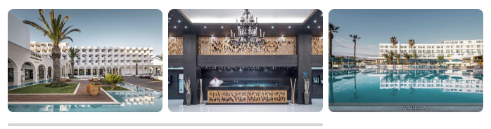
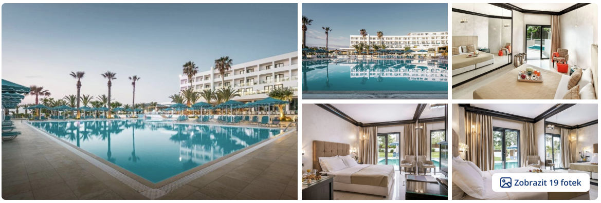
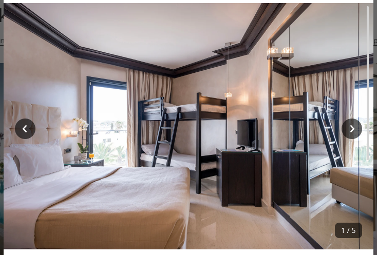
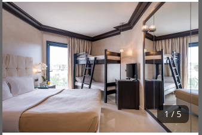
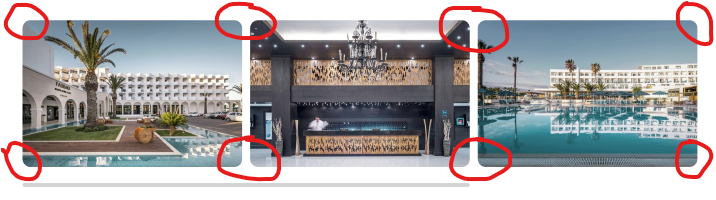
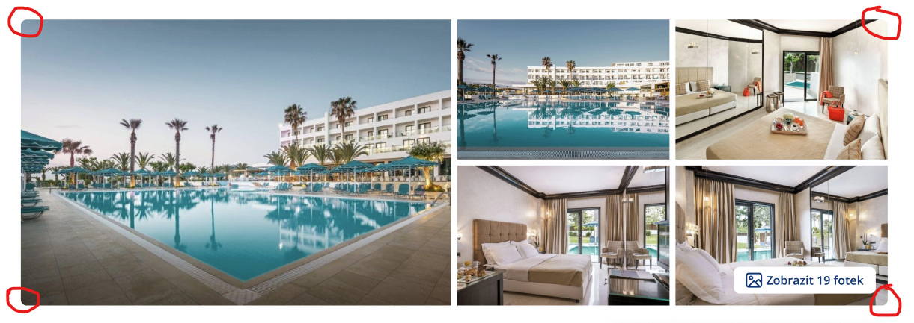
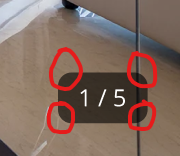
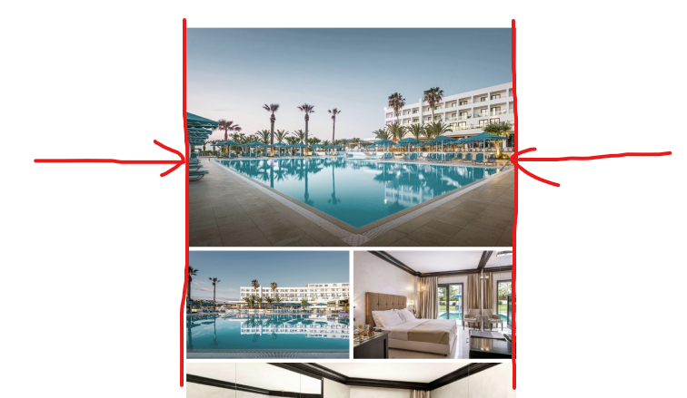
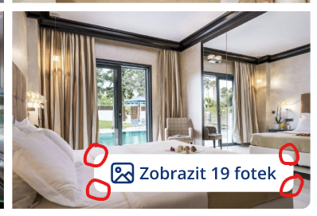

# Gallery
Komponenty pro galerie `@npm-tee/abnb`

## Instalace
```
npm i @npm-tee/abnb
```

## Styly
Je nutné importovat styly a to buď v js
```js
import "@npm-tee/abnb/style.css";
```
nebo jako styly v css
```css
@import url("@npm-tee/abnb/style.css");
```

## Použití
K dispozici máme tři komponenty pro galerii `AbnbGalleryInline`, `AbnbGalleryGrid` a `AbnbGallerySingle`.

::: info
Galerie injectuje proměnnou `contentPadding`. Ze které se v případě mobilního zobrazení nastaví záporné marginy. Viz [grafický návrh](https://www.figma.com/file/mJ2TSNVSOhrJp1vHakNIgB/CK-FISCHER?type=design&node-id=3730-5589&mode=design&t=q2uArQjhf6UXDx8U-4) např. v popup okně

**Definice**
```ts
const parentPadding = inject<Ref<{
    left: string;
    right: string;
}> | undefined>("contentPadding", undefined);
```
:::

### `AbnbGalleryInline` galerie pro řádkový výpis 
Definice v [grafickém manuálu](https://www.figma.com/file/mJ2TSNVSOhrJp1vHakNIgB/CK-FISCHER?type=design&node-id=4302-889&mode=design&t=q2uArQjhf6UXDx8U-4).



```vue
<script setup lang="ts">
    import { ref } from "vue";
    import {AbnbGalleryInline} from "@npm-tee/abnb";

    type Image = {
        src: string;
        alt: string;
        description?: string;
    }

    const images = ref<Array<Image>>([{
        src: "./image01.jpeg",
        alt: "",
    }])

</script>
<template>
    <AbnbGalleryInline :images="images" />
</template>
```

### `AbnbGalleryGrid` galerie pro gridový výpis 
Definice v [grafickém manuálu](https://www.figma.com/file/mJ2TSNVSOhrJp1vHakNIgB/CK-FISCHER?type=design&node-id=3557-3306&mode=design&t=fxKOwUeSLxvEfE6k-4).



```vue

<script setup lang="ts">
    import {computed, ref} from "vue";
    import {AbnbGalleryGrid} from "@npm-tee/abnb";

    type Image = {
        src: string;
        alt: string;
        description?: string;
    }

    const images = ref<Array<Image>>([{
        src: "./image01.jpeg",
        alt: "",
    }])

    const buttonText = computed(() => {
        return `Zobrazit ${images.value.length} fotek`;
    })
</script>
<template>
    <AbnbGalleryGrid :images="images" :grid-button-text="buttonText"/>
</template>
```

### `AbnbGallerySingle` galerie pro výpis jedné fotky 
::: info
Všechny varianty galerií se automaticky přepnou do mobilního zobrazení, pokud jsou k tomu donuceny šířkou elementu `400px`, ve kterém se nacházejí.
:::

Definice v grafickém manuálu [desktop verze](https://www.figma.com/file/mJ2TSNVSOhrJp1vHakNIgB/CK-FISCHER?type=design&node-id=3729-4311&mode=design&t=fxKOwUeSLxvEfE6k-4) a [mobilní verz](https://www.figma.com/file/mJ2TSNVSOhrJp1vHakNIgB/CK-FISCHER?type=design&node-id=3730-4956&mode=design&t=fxKOwUeSLxvEfE6k-4) bez šipek.

| Desktop | Mobilní |
|---------|---------|
| | |


```vue
<script setup lang="ts">
    import { ref } from "vue";
    import {AbnbGallerySingle} from "@npm-tee/abnb";

    type Image = {
        src: string;
        alt: string;
        description?: string;
    }
    
    const images = ref<Array<Image>>([{
        src: "./image01.jpeg",
        alt: "",
        description: "Kočička s klubíčkem"
    }])
</script>
<template>
    <AbnbGallerySingle :images="images" />
</template>
```
## Props

| Prop               | Definice                                                   | Výchozí         | Popis                                                                                                                               |
|--------------------|------------------------------------------------------------|-----------------|-------------------------------------------------------------------------------------------------------------------------------------|
| `images`           | `Array<{src: string; alt: string; description?: string;}>` |            | Určuje nastavení tailwind class pro **font-weight**, **line-height** a **font-size**                                                |
| `grid-button-text` | `string`                                                   | `""` | Pouze pro `AbnbGalleryGrid`, není-li definováno, nebo je prázdný řetězec, obecné tlačítko pro otevření detailu galerie se nezobrazí |

## Proměnné pro styly

::: info Seznam všech proměnných pro zkopírování
```css
--abnbGalleryDetail-maxWidth: 640px;
--abnbGalleryGrid-buttonDefaultColorText: hsla(213, 100%, 23%, 1);
--abnbGalleryGrid-buttonDefaultColorBackground: theme("colors.white");
--abnbGalleryGrid-buttonHoverColorText: theme("colors.white");
--abnbGalleryGrid-buttonHoverColorBackground: hsla(209, 100%, 42%, 1);
--abnbGalleryGrid-buttonBorderRadius: theme("borderRadius.md");
--abnbGallery-imageRadius: theme("borderRadius.lg");
--abnbGallery-counterRadius: theme("borderRadius.lg");
```
:::

### `--abnbGallery-imageRadius`
| Výchozí hodnota           | Popis                                                                   |
|---------------------------|-------------------------------------------------------------------------|
| theme("borderRadius.lg")  | Velikost zaoblení rohů gallerie, nebo obrázků v galerii                 |





### `--abnbGallery-counterRadius`
| Výchozí hodnota           | Popis                                                                                   |
|---------------------------|-----------------------------------------------------------------------------------------|
| theme("borderRadius.lg")  | Velikost zaoblení rohů pro mobilní ukazatel zobrazeného obrázku a celkového počtu fotek |



### `--abnbGalleryDetail-maxWidth`
| Výchozí hodnota           | Popis                                                                      |
|---------------------------|----------------------------------------------------------------------------|
| 640px  | Maximální šířka obsahu pro výpis fotek v celkovém přehledovém výpisu fotek |



### `--abnbGalleryGrid-buttonDefaultColorText`
| Výchozí hodnota           | Popis                                                                      |
|---------------------------|----------------------------------------------------------------------------|
| hsla(213, 100%, 23%, 1)  | Barva textu pro tlačítko v `AbnbGalleryGrid` |


### `--abnbGalleryGrid-buttonDefaultColorBackground`
| Výchozí hodnota           | Popis                                                                      |
|---------------------------|----------------------------------------------------------------------------|
| theme("colors.white")  | Barva pozadí pro tlačítko v `AbnbGalleryGrid` |

### `--abnbGalleryGrid-buttonHoverColorText`
| Výchozí hodnota           | Popis                                                                      |
|---------------------------|----------------------------------------------------------------------------|
| theme("colors.white")  | Barva textu pro tlačítko v `AbnbGalleryGrid` při hover stavu |

### `--abnbGalleryGrid-buttonHoverColorBackground`
| Výchozí hodnota           | Popis                                                                      |
|---------------------------|----------------------------------------------------------------------------|
| hsla(209, 100%, 42%, 1)   | Barva pozadí pro tlačítko v `AbnbGalleryGrid` při hover stavu |

### `--abnbGalleryGrid-buttonBorderRadius`
| Výchozí hodnota           | Popis                                                                      |
|---------------------------|----------------------------------------------------------------------------|
| theme("borderRadius.md")   | Velikost zaoblení rohů pro tlačítko v `AbnbGalleryGrid` |


