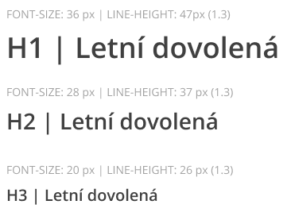
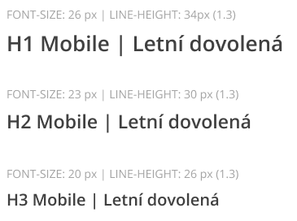

# AbnbTitle (nadpis)
Komponenta pro nadpisy, která je součástí balíčku `@npm-tee/abnb`

## Použití

**Styl i element h2**
```js
<AbnbTitle>Krásný nadpis</AbnbTitle>
```

**styl i element h1**
```js
<AbnbTitle style="h1">Krásný nadpis</AbnbTitle>
```

**Styl h1, ale element div**
```js
<AbnbTitle style="h1" element="div">Krásný nadpis</AbnbTitle>
```

## Props

| Prop      | Hodnoty                                           | Výchozí                | Popis                                                                                        |
|-----------|---------------------------------------------------|------------------------|----------------------------------------------------------------------------------------------|
| `style`   | `h1`, `h2`, `h3`                                  | `h2`                   | Určuje nastavení tailwind class pro **font-weight**, **line-height** a **font-size**        |
| `element` | `h1`, `h2`, `h3`, `h4`, `h5`, `h6`, `div`, `span` | hodnota z prop `style` | Html element odpovídá nastavené hodnotě. |
## Vzhled
Vzhled je definován [grafickým manuálem](https://www.figma.com/file/mJ2TSNVSOhrJp1vHakNIgB/CK-FISCHER?type=design&node-id=4942-1123&mode=design&t=4EYe2XG5PgCGjyfB-4)

### Desktop


### Mobil


