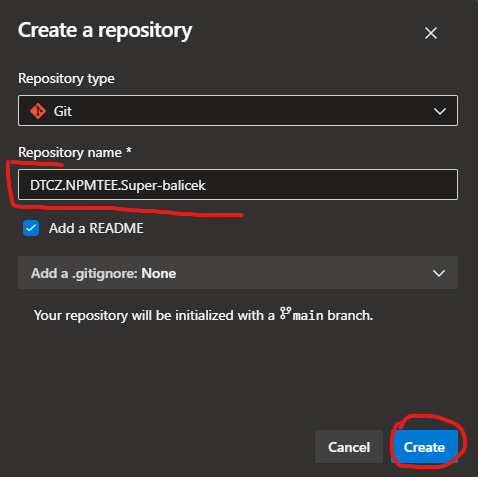

# Create
Umístění balíčku [`https://www.npmjs.com/package/@npm-tee/creator`](https://www.npmjs.com/package/@npm-tee/creator)

Balíček umožňující snadné prvnotní vytvoření nového balíčku. Výsledkem vytvořeného balíčku je složka s potřebnými soubory.

:::info Testy
V balíčku je pro testy nastaveny vitest, který je zároveň napojen na pipeline a proto, pokud testy neprojdou, balíček nebude vystaven.
:::

:::warning Pozor na styly
Ve vytvořeném balíčku existují dva soubory stylů
- **tailwind.css** - slouží pouze pro lokální testování, takže zde nepřidávat žádné styly, které se mají exportovat s balíčkem
- **style.css** - styly které se exportují s balíčkem v `main.ts` je `import "./style.css";`, který zajistí, že se styly zbuildí s balíčkem.
:::

## Spuštění
Balíček vytvoříme spuštěním příkazu `bun x @npm-tee/creator` dále se řídíme pokyny na obrazovce.

## Vytvoření git repozitáře
:::warning Název repozitáře
Název repozitáře by se měl shodovat s názvem balíčku. Který je zapsán bez diakritiky, kebab case stylem, s prvním velkým písmenem a s předponou DTCZ.NPMTEE.

Př.: `DTCZ.NPMTEE.Nejaky-super-nazev-balicku`
:::
1. Přejdeme na https://dev.azure.com/DTCZ/NPM%20TEE/_settings/repositories
2. Klikneme vpravo nahoře na tlačítko `+ Create`
3. Vyplníme název repozitáže a vytvoříme repozitář klikem na tlačítko `Create` 

## Napojení git repozitáře
Napojit repozitář lze pomocí příkazové řádky, nebo pomocí IDE.

### Napojení pomocí příkazové řádky
1. Otevřeme si příkazovou řádku tak, aby ukazovala do složky balíčku
2. Incializujeme git příkazem `git init -b main`
3. Zjistíme si git adresu repozitáře pro náš balíček (stejná cesta, kterou bychom použili pro klonování repozitáře) např. `git@ssh.dev.azure.com:v3/DTCZ/NPM%20TEE/DTCZ.NPMTEE.Testovaci-balicek`
4. Propojíme repozitáře (v ukázce použijeme cestu z bodu 3) `git remote add origin URL_K_REPOZITÁŘI`  př. `git remote add origin git@ssh.dev.azure.com:v3/DTCZ/NPM%20TEE/DTCZ.NPMTEE.Testovaci-balicek`
5. Přidáme všechny soubory do komitu příkazem `git add .`
6. Komitneme změny `git commit -am "Initial commit"`
7. Pushneme změny do gitu `git push origin -u -f main`. _Marek: možná má hezčí řešení, ale nic jiného mi nefungovalo_

### Napojení pomocí IDE
**TODO: doplnit dle potřeby**

## Zavedení azure pipeline
Po pushnutí balíčku na git, je potřeba navést azure pipeline pro automatické buildění a vystavení balíčku.

1. Přejdeme na https://dev.azure.com/DTCZ/NPM%20TEE/_build
2. Klikneme na tlačítko `New Pipeline` 
3. Vybereme `Azure Repos Git` 
4. Vybere repozitář, který cheme napojit 
5. Svůj výběr potvrdíme klikem na tlačítko `Run` 