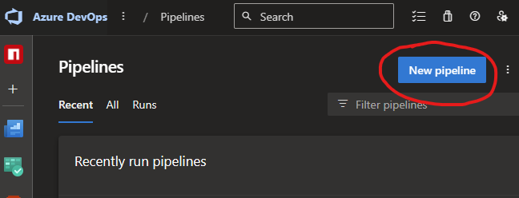
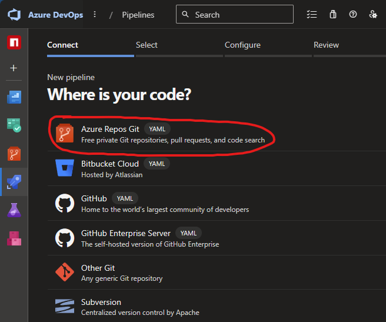
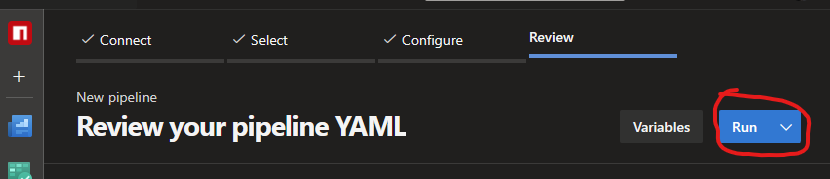

---
next:
  text: 'Abnb'
  link: '/npmtee/abnb/index'
---

# Vytvoření NPM balíčku
Nový NPMTEE balíček vytvoříme jednoduše pomocí "vytvářecího balíčku".

## Příprava

Ve složce, kde se bude skript spouštět musí být soubor `.npmrc` s títmto obsahem.

```
@npm-tee:registry=https://pkgs.dev.azure.com/DTCZ/_packaging/NPM-TEE/npm/registry/
always-auth=true
```

## Spuštění
Balíček ve složce spustíme příkazem `npx @npm-tee/creator` dále se řídíme pokyny na obrazovce.

:::warning Pozor na styly
Ve vytvořeném balíčku existují dva soubory stylů
- **tailwind.css** - slouží pouze pro lokální testování, takže zde nepřidávat žádné styly, které se mají exportovat s balíčkem
- **style.css** - styly které se exportují s balíčkem v `main.ts` je `import "./style.css";`, který zajistí, že se styly zbuildí s balíčkem.
:::
## Navedení azure pipeline
Po pushnutí balíčku na git, je potřeba navést azure pipeline pro automatické buildění a vystavení balíču.

1. Přejdeme na https://dev.azure.com/DTCZ/NPM%20TEE/_build
2. Klikneme na tlačítko `New Pipeline`<br>
3. Vybereme `Azure Repos Git`<br>
4. Svůj výběr potvrdíme klikem na tlačítko `Run`<br>