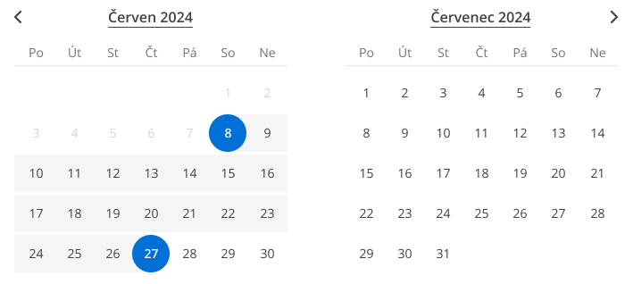
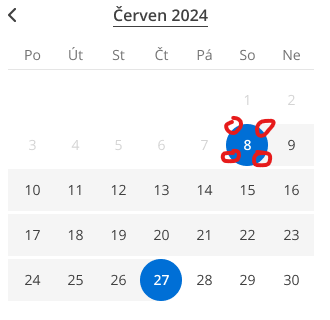
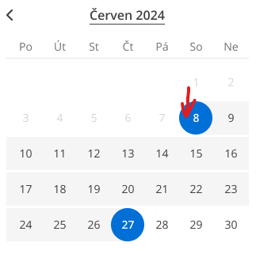
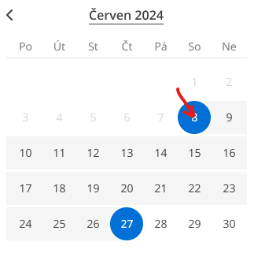

# InlineDatePicker
Komponenty pro InlineDatePicker `@npm-tee/inline-date-picker`

## Instalace
```
npm i @npm-tee/inline-date-picker
```

## Styly
Je nutné importovat styly a to buď v js
```js
import "@npm-tee/inline-date-picker/style.css";
```
nebo jako styly v css
```css
@import url("@npm-tee/inline-date-picker/style.css");
```

## Použití
K dispozici máme jednu komponentu pro výběr datumu `InlineDatePickerInterval`.

### `InlineDatePickerInterval` výběr rozsahu datumů v intervalu
Definice v [grafickém manuálu](https://www.figma.com/file/mJ2TSNVSOhrJp1vHakNIgB/CK-FISCHER?type=design&node-id=7269-1314&mode=design&t=PD8HIV7sZFQsd1JD-4).



```vue
<script setup lang="ts">

    import InlineDatePickerInterval from "./components/InlineDatePickerInterval.vue";
    import { ref } from "vue";

    const selectedDates = ref<{from: string; to: string;}>({
        from: "2024-03-07",
        to: "2024-03-20"
    });
</script>

<template>
    <InlineDatePickerInterval v-model="selectedDates" :calendars-count="2"  class="w-full grid grid-cols-2 gap-6" />
</template>
```
## Události
| Událost                | Definice                                             | Popis                                                                    |
|------------------------|------------------------------------------------------|--------------------------------------------------------------------------|
| `elementsCountChanges` | `elementsCountChanges(elements: Array<HTMLElement>)` | Při změně počtů kalednářů, vrací pole HTML elementů, pro dané kalendáře |
## Props

| Prop                   | Definice         | Výchozí      | Popis                                                                                                                                                  |
|------------------------|------------------|--------------|--------------------------------------------------------------------------------------------------------------------------------------------------------|
| `language`             | `string`         | `cs`         | Definuje jazyk ve kterém se zobrují názvy dní a měsíců, stejně tak se z něj bere formát vypisovaného datumu a první den v týdnu (pondělí, nebo neděle) |
| `minimum-date`         | `Date \| string` | `new Date()` | Objekt data, nebo ISODate string (YYYY-MM-DD) určující minimální datum od kterého (včetně) může uživatel vybírat                                       |
| `generate-from-month`  | `Date \| string` | `undefined`  | Objekt data, nebo ISODate string (YYYY-MM , YYYY-MM-DD) určující od jakého měsíce se kalendář vykreslí                                                 |
| `calendars-count`      | `number`         | `0`          | Kolik kalendářů za sebou se má vykreslit. Pokud je `0` vykreslí se počet kalendářů roven `props.maximumMonthsCount`                                    |
| `minimum-nights-count` | `number`         | `0`          | Minimální počet nocí, které může uživatel vybrat. Tzn. že `props.minimumNightsCount + 1` je minimální počet dní, které uživatel musí vybrat            | 
| `maximum-nights-count` | `number`         | `60`         | Maximální počet nocí, které může uživatel vybrat.                                                                                                      | 
| `maximum-months-count` | `number`         | `12`         | Maximální počet měsíců ve kterých lze datumy vybírat.                                                                                                  | 


## Proměnné pro styly

::: info Seznam všech proměnných pro zkopírování
```css
--inlineDatePicker-selectedDayRounding: theme("borderRadius.full");
--inlineDatePicker-selectedDayColorBackground: theme("textColor.blue.600");
--inlineDatePicker-selectedDayColorText: theme("backgroundColor.white");
```
:::

### `--inlineDatePicker-selectedDayRounding`
| Výchozí hodnota            | Popis                           |
|----------------------------|---------------------------------|
| theme("borderRadius.full") | Velikost zaoblení vybraného dne |



### `--inlineDatePicker-selectedDayColorBackground`
| Výchozí hodnota             | Popis                      |
|-----------------------------|----------------------------|
| theme("textColor.blue.600") | Barva pozadí vybraného dne |



### `--inlineDatePicker-selectedDayColorText`
| Výchozí hodnota                | Popis                     |
|--------------------------------|---------------------------|
| theme("backgroundColor.white") | Barva textu vybraného dne |

