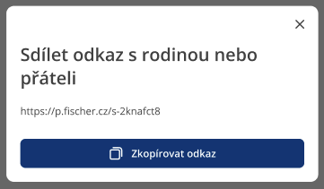
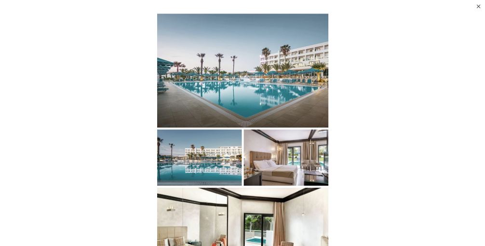

---
prev:
  text: 'AbnbTitle (nadpis)'
  link: '/npmtee/abnb/title'
next:
  text: 'Icons'
  link: '/npmtee/icons/'
outline: deep
---
# Instalace
```
npm i @npm-tee/modal-dialogs
```
## Použití
K dipsozici máme dvě komponenty pro modální okno `ModalDialog` a `ModalGallery`.
### `ModalDialog`
Klasický dialog, jehož velikost určuje samotný obsah v dialogu.



**Minimální vzor**
```vue
<script setup lang="ts">
    import {ref} from "vue";
    import {ModalDialog} from "@npm-tee/modal-dialogs";

    const showModal = ref(false);
</script>

<template>
    <button @click="showModal = true">Otevřít okno</button>

    <ModalDialog v-model="showModal">
        Obsah popup okna
    </ModalDialog>
</template>
```

**Ukázka s titulkem a patičkou**
```vue{12,13,15,16,18}
<script setup lang="ts">
    import {ref} from "vue";
    import {ModalDialog, ModalDialogTitle} from "@npm-tee/modal-dialogs";

    const showModal = ref(false);
</script>

<template>
    <button @click="showModal = true">Otevřít okno</button>
    
    <ModalDialog v-model="showModal">
        <template v-slot:default>
            <ModalDialogTitle>Titulek dialogu</ModalDialogTitle>
            Obsah popup okna
        </template>
        <template v-slot:footer>
            Nějaký obsah v patičce
        </template>
    </ModalDialog>
</template>
```
::: info
Komponenty umístěné ve `slot:default` mají přístup k proměnné `contentPadding`, která obsahuje velikost levého a pravého paddingu kolem obsahu modálního dialogu.

Hodnoty paddingů se počítají pomocí [window.getComputedStyle()](https://developer.mozilla.org/en-US/docs/Web/API/Window/getComputedStyle).

**contentPadding** definice
```js
const contentPadding = ref({
    left: "",
    right: ""
})
provide("contentPadding", contentPadding);
```
:::

### `ModalGallery`
Dialog, který vyplní celou plochu viewportu (vykreslovací plocha prohlížeče) s animací vyjíždění z levé strany.



```vue
<script setup lang="ts">
    import {ref} from "vue";
    import {ModalGallery} from "@npm-tee/modal-dialogs";

    const showModal = ref(false);
</script>

<template>
    <button @click="showModal = true">Otevřít okno</button>

    <ModalGallery v-model="showModal">
        Obsah popup okna
    </ModalGallery>
</template>
```
