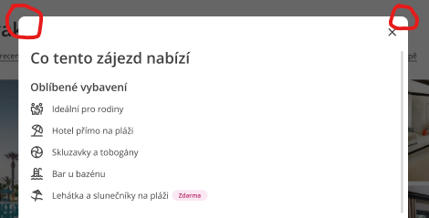

---
prev:
  text: 'AbnbTitle (nadpis)'
  link: '/npmtee/abnb/title'
next:
  text: 'Icons'
  link: '/npmtee/icons/'
outline: deep
---
# Instalace
```
npm i @npm-tee/modal-dialogs
```

## Styly
Je nutné importovat styly a to buď v js
```js
import "@npm-tee/modal-dialogs/style.css";
```
nebo jako styly v css
```css
@import url("@npm-tee/modal-dialogs/style.css");
```

## Použití
K dispozici máme dvě komponenty pro modální okno `ModalDialog` a `ModalGallery`.

:::warning Pozor na zanořené modály
Pro zanořené modály (modál v modálu) je potřeba používat vždy modály z této knihovny. Pokud použijeme modál z této knihovnu do kterého zanoříme `Dialog` z headlessui, tak při zavření či kliknutí do headlessui modálu, se zavřou všechny modály najednou.
:::

### `ModalDialog`
Modální dialog má maximální šířku vždy nastavenou na 720px.


**Minimální vzor**
Takový dialog má nastaveno `width: 100%;` a maximální šířku 720px - což mají všechny druhy dialogů
```vue
<script setup lang="ts">
    import {ref} from "vue";
    import {ModalDialog} from "@npm-tee/modal-dialogs";

    const showModal = ref(false);
</script>

<template>
    <button @click="showModal = true">Otevřít okno</button>

    <ModalDialog v-model="showModal">
        Obsah popup okna
    </ModalDialog>
</template>
```

**Modal s šířkou dle obsahu**
```vue
<script setup lang="ts">
    import {ref} from "vue";
    import {ModalDialog} from "@npm-tee/modal-dialogs";

    const showModal = ref(false);
</script>

<template>
    <button @click="showModal = true">Otevřít okno</button>

    <ModalDialog v-model="showModal" width-based-on-content>
        Obsah popup okna
    </ModalDialog>
</template>
```

**Modal s vlastní šířkou**
```vue{12}
<script setup lang="ts">
    import {ref} from "vue";
    import {ModalDialog} from "@npm-tee/modal-dialogs";

    const showModal = ref(false);
</script>

<template>
    <button @click="showModal = true">Otevřít okno</button>

    <ModalDialog v-model="showModal"
        width-based-on-content
        dialog-panel-class="w-full max-w-[300px] lg:max-w-[700px]"
    >
        Obsah popup okna
    </ModalDialog>
</template>
```

**Ukázka s titulkem a patičkou**
```vue{12,13,15,16,18}
<script setup lang="ts">
    import {ref} from "vue";
    import {ModalDialog, ModalDialogTitle} from "@npm-tee/modal-dialogs";

    const showModal = ref(false);
</script>

<template>
    <button @click="showModal = true">Otevřít okno</button>
    
    <ModalDialog v-model="showModal">
        <template v-slot:default>
            <ModalDialogTitle>Titulek dialogu</ModalDialogTitle>
            Obsah popup okna
        </template>
        <template v-slot:footer>
            Nějaký obsah v patičce
        </template>
    </ModalDialog>
</template>
```
::: info
Komponenty umístěné ve `slot:default` a `slot:footer` mají přístup k proměnné `contentPadding`, která obsahuje velikost levého a pravého paddingu kolem obsahu v daném slotu.

Hodnoty paddingů se počítají pomocí [window.getComputedStyle()](https://developer.mozilla.org/en-US/docs/Web/API/Window/getComputedStyle).

**contentPadding** definice
```js
const contentPadding = ref({
    left: "",
    right: ""
})
provide("contentPadding", contentPadding);
```
:::
#### Props

| Prop                     | Definice | Výchozí | Popis                                                                                               |
|--------------------------|----------|---------|-----------------------------------------------------------------------------------------------------|
| `dialogPanelClass`       | `string` | `""`    | Přidá css classy modal dialogu (vnitřní bílý obsah). Možno použít např. pro definici šířky okna ap. |
| `width-based-on-content` | `boolean` | `false`| Popup si nenastavuje žádnou velikost                                                                |

### `ModalGallery`
Dialog, který vyplní celou plochu viewportu (vykreslovací plocha prohlížeče) s animací vyjíždění z levé strany.


```vue
<script setup lang="ts">
    import {ref} from "vue";
    import {ModalGallery} from "@npm-tee/modal-dialogs";

    const showModal = ref(false);
</script>

<template>
    <button @click="showModal = true">Otevřít okno</button>

    <ModalGallery v-model="showModal">
        Obsah popup okna
    </ModalGallery>
</template>
```
## Proměnné pro styly

::: info Seznam všech proměnných pro zkopírování
```css
--modalDialog-roundingWindow: theme("borderRadius.xl");
```
:::

### `--modalDialog-roundingWindow`
| Výchozí hodnota           | Popis                                    |
|---------------------------|------------------------------------------|
| theme("borderRadius.xl")  | Velikost zaoblení rohů modálního dialogu |


